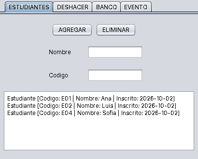
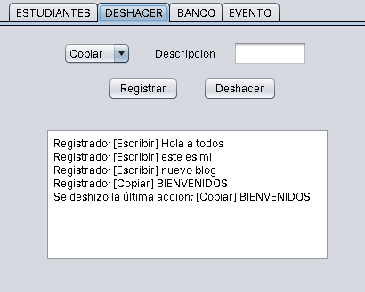
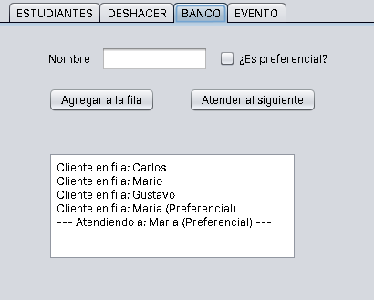
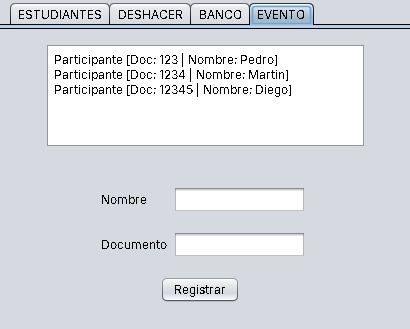

# TechSolutions: Estructuras de Datos con Interfaz Gráfica en Java

Aplicación de escritorio en **Java 21 + Swing** que resuelve cuatro problemas cotidianos, cada uno con la estructura de datos que mejor encaja: una lista, una pila, una cola con prioridad y un conjunto. Los cuatro módulos están en una sola ventana con pestañas y comparten la misma arquitectura (modelo, lógica y vista separados).

> Proyecto académico de Ingeniería de Sistemas (CUN).

## Capturas de pantalla

| Estudiantes | Deshacer |
|---|---|
|  |  |

| Banco | Evento |
|---|---|
|  |  |

## Módulos

| Pestaña | Estructura | Clase de lógica | Qué hace |
|---|---|---|---|
| **ESTUDIANTES** | `ArrayList<Estudiante>` | `GestionEstudiantes` | Inscribe estudiantes con nombre y código (la fecha de inscripción se asigna automáticamente), los lista y los elimina por nombre sin distinguir mayúsculas. |
| **DESHACER** | `Stack<Accion>` | `SistemaDeshacer` | Registra acciones de tipo *Escribir, Borrar, Copiar o Pegar*. El botón **Deshacer** retira la última registrada (LIFO). |
| **BANCO** | `PriorityQueue<Cliente>` | `AtencionBanco` | Agrega clientes a la fila y atiende primero a los **preferenciales**; entre clientes del mismo tipo respeta el **orden de llegada**. |
| **EVENTO** | `HashSet<Participante>` | `ControlAcceso` | Registra asistentes y **rechaza duplicados** usando el documento como identificador (`equals` y `hashCode` sobre el documento). |

### Cómo funciona la prioridad del banco

```java
new PriorityQueue<>(
    Comparator.comparing(Cliente::isPreferencial).reversed()
              .thenComparing(Cliente::getOrden)
);
```

Si llegan Carlos, Mario, Gustavo (regulares) y luego María (preferencial), la primera en ser atendida es María; después siguen Carlos, Mario y Gustavo en su orden de llegada.

### Cómo se detectan los duplicados

`Participante` sobrescribe `equals` y `hashCode` usando solo el documento. Así, `HashSet.add()` devuelve `false` si ya existe alguien con el mismo documento, aunque el nombre cambie.

## Tecnologías

- **Lenguaje:** Java 21
- **Interfaz:** Swing (Nimbus Look and Feel), diseñada con el editor visual de NetBeans
- **Colecciones:** `ArrayList`, `Stack`, `PriorityQueue`, `HashSet`
- **IDE y build:** Apache NetBeans (proyecto Ant)
- **Control de versiones:** Git y GitHub

## Estructura del proyecto

```
Interfaces---Logica/
├── src/
│   ├── modelo/                 # Clases de datos
│   │   ├── Estudiante.java
│   │   ├── Accion.java
│   │   ├── Cliente.java
│   │   └── Participante.java
│   ├── logica/                 # Reglas de negocio, sin código de interfaz
│   │   ├── GestionEstudiantes.java
│   │   ├── SistemaDeshacer.java
│   │   ├── AtencionBanco.java
│   │   └── ControlAcceso.java
│   ├── vista/                  # Interfaz gráfica (Swing)
│   │   ├── VentanaPrincipal.java
│   │   └── VentanaPrincipal.form
│   └── techsolutions/
│       ├── App.java            # Punto de entrada de la interfaz gráfica
│       └── TechSolutions.java  # Versión de consola con menú de pruebas
├── docs/                       # Capturas de pantalla
├── nbproject/                  # Configuración de NetBeans
└── manifest.mf
```

## Requisitos

- **JDK 21** o superior. Verifica tu versión con:

```bash
java -version
```

## Cómo ejecutarlo

### Opción 1: con Apache NetBeans

1. Clona el repositorio:

```bash
git clone https://github.com/MaicolAvila00/Interfaces---Logica.git
```

2. En NetBeans: **File → Open Project** y selecciona la carpeta clonada.
3. Para abrir la interfaz gráfica, clic derecho sobre `App.java` (o `VentanaPrincipal.java`) → **Run File**.

> El proyecto tiene como clase principal `TechSolutions`, que es la versión de consola. Por eso **Run Project** (F6) abre el menú de texto y no la ventana.

### Opción 2: desde la terminal

Linux o macOS:

```bash
javac -encoding UTF-8 -d out $(find src -name "*.java")
java -cp out techsolutions.App
```

Windows (PowerShell):

```powershell
mkdir out
javac -encoding UTF-8 -d out (Get-ChildItem -Recurse src -Filter *.java).FullName
java -cp out techsolutions.App
```

### Opción 3: generar un JAR ejecutable

```bash
jar cfe TechSolutions.jar techsolutions.App -C out .
java -jar TechSolutions.jar
```

### Versión de consola

```bash
java -cp out techsolutions.TechSolutions
```

Muestra un menú con cuatro demostraciones (una por módulo) usando datos de ejemplo.

## Guía de uso rápida

1. **Estudiantes:** escribe nombre y código y pulsa **AGREGAR**. Para eliminar, escribe el nombre y pulsa **ELIMINAR**.
2. **Deshacer:** elige el tipo de acción, escribe una descripción y pulsa **Registrar**. **Deshacer** retira la última.
3. **Banco:** escribe el nombre, marca **¿Es preferencial?** si aplica y pulsa **Agregar a la fila**. **Atender al siguiente** llama al cliente con mayor prioridad.
4. **Evento:** escribe nombre y documento y pulsa **Registrar**. Si el documento ya existe, aparece un aviso de duplicado y no se agrega.

Los campos vacíos se validan y muestran un mensaje antes de procesar.

## Conceptos que practica

- Selección de la estructura de datos según el problema (LIFO, FIFO con prioridad, unicidad).
- Comparadores encadenados (`Comparator.comparing(...).reversed().thenComparing(...)`).
- Contrato `equals` / `hashCode` para colecciones basadas en hash.
- Separación en capas: modelo, lógica y vista.
- Eventos y componentes de Swing: pestañas, formularios, `JComboBox`, `JCheckBox`, `JTextArea` y diálogos.


## Autor

**Maicol Ávila**, Desarrollador Junior Full Stack | Estudiante de Ingeniería de Sistemas

- GitHub: [MaicolAvila00](https://github.com/MaicolAvila00)
- LinkedIn: [maicol-avila-032503210](https://linkedin.com/in/maicol-avila-032503210)
- Portafolio: [portofoliov1-maicol-avilas-projects.vercel.app](https://portofoliov1-maicol-avilas-projects.vercel.app)
